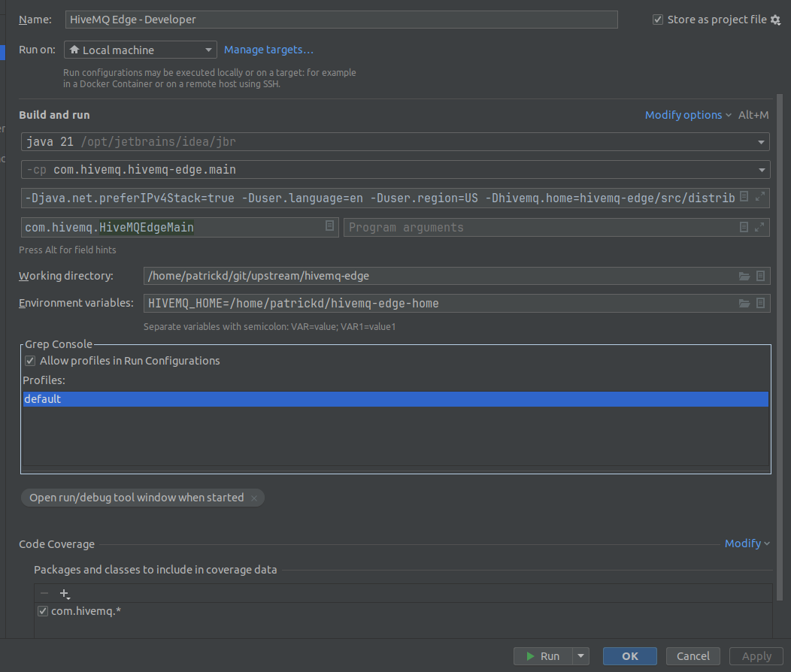

# Run locally

## Setup dependencies

Make sure to also pull the latest version of the dependencies, like `hivemq-edge-adapter-sdk` etc.

## Start frontend

```bash
cd ~/git/upstream/hivemq-edge/hivemq-edge-frontend
pnpm dev
```

## Start backend

In intellij with java 21, build once by "Execute gradle task" `gradle :hivemqEdgeZip`  
Then start in debugging with
```bash
java 21
-cp com.hivemq.hivemq-edge.main
-Djava.net.preferIPv4Stack=true -Duser.language=en -Duser.region=US -Dhivemq.home=hivemq-edge/src/distribution -Dhivemq.edge.config.xml=developer-config.xml -Dhivemq.edge.workspace.modules=true -Dhivemq.edge.workspace.commercial-modules=true -Dcom.sun.management.jmxremote -Dcom.sun.management.jmxremote.port=9010 -Dcom.sun.management.jmxremote.local.only=false -Dcom.sun.management.jmxremote.authenticate=false -Dcom.sun.management.jmxremote.ssl=false -noverify --add-opens java.base/java.lang=ALL-UNNAMED --add-opens java.base/java.nio=ALL-UNNAMED --add-opens java.base/sun.nio.ch=ALL-UNNAMED --add-opens jdk.management/com.sun.management.internal=ALL-UNNAMED --add-exports java.base/jdk.internal.misc=ALL-UNNAMED -Xmx64M
com.hivemq.HiveMQEdgeMain

Working directory: /home/patrickd/git/upstream/hivemq-edge
Environment variables: HIVEMQ_HOME=/home/patrickd/hivemq-edge-home
```


# Remote debugging

At this to the statefulset and restart the pod

**NOTE** the `suspend=y` makes the pod do nothing until the debugger is connected

Also increase the time for the liveness probe, otherwise the pod will get killed while debugging

```yaml
command:
- "java"
args:
- "-agentlib:jdwp=transport=dt_socket,server=y,suspend=y,address=*:5005"
- "-Dhivemq.home=/opt/hivemq"
- "-XX:HeapDumpPath=/opt/hivemq/heap-dump.hprof"
- "-XX:ErrorFile=/opt/hivemq/hs_err_pid%p.log"
- "-XX:+UnlockExperimentalVMOptions"
- "-XX:InitialRAMPercentage=75"
- "-XX:MaxRAMPercentage=75"
- "-Djava.net.preferIPv4Stack=true"
- "--add-opens"
- "java.base/java.lang=ALL-UNNAMED"
- "--add-opens"
- "java.base/java.nio=ALL-UNNAMED"
- "--add-opens"
- "java.base/sun.nio.ch=ALL-UNNAMED"
- "--add-opens"
- "jdk.management/com.sun.management.internal=ALL-UNNAMED"
- "--add-exports"
- "java.base/jdk.internal.misc=ALL-UNNAMED"
- "-Djava.security.egd=file:/dev/./urandom"
- "-Dcom.sun.management.jmxremote"
- "-Dcom.sun.management.jmxremote.port=9010"
- "-Dcom.sun.management.jmxremote.local.only=false"
- "-Dcom.sun.management.jmxremote.authenticate=false"
- "-Dcom.sun.management.jmxremote.ssl=false"
- "-Duser.language=en"
- "-Duser.region=US"
- "-XX:+CrashOnOutOfMemoryError"
- "-XX:+HeapDumpOnOutOfMemoryError"
- "-jar"
- "/opt/hivemq/bin/hivemq.jar"
```
